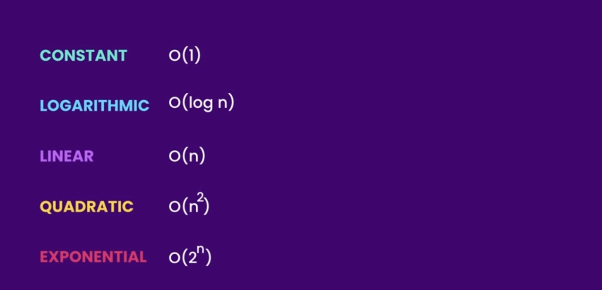
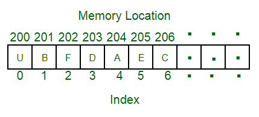
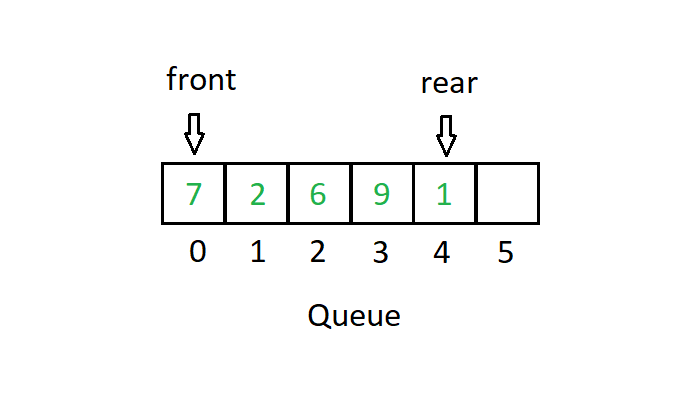
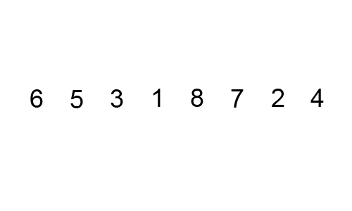
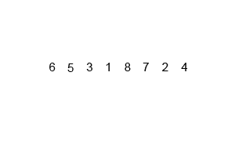
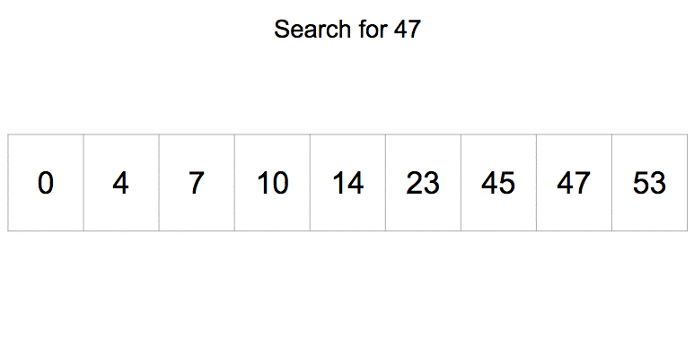

# Data Structures & Algorithms

This Repository is made for anyone who wants to learn about Big-O Notation, Data Structures, and Algorithms.

#### We Will Be Discussing Big-O Notation
---
- [What is Big-O?](#what-is-big-o)
- [Big-O Cases From Best To Worst](#big-o-cases)
- [Big-O Basic Rules](#big-o-rules)

#### We Will Be Covering The Well-Known Data Structures
---
- [Array Data Structure: (Fixed Size)](#array-structure-fixed-size)
- [Dynamic Array Data Structure: (Double Size)](#dynamic-array-structure-double-size)
- [Linked List Data Structure](#linked-list-data-structure)
- [Stack Data Structure](#stack-data-structure)
- [Queue Data Structure](#queue-data-structure)
- [Hash Table Data Structure](#hash-table-data-structure)
- [Tree Data Structure (Coming Soon)](#tree-data-structure)
- [Graph Data Structure (Coming Soon)](#graph-data-structure)
- [Heap Data Structure (Coming Soon)](#heap-data-structure)
- [Trie Data Structure (Coming Soon)](#trie-data-structure)

#### We Will Be Discussing Some Of The Famous Algorithms Like
---
- **Sorting Algorithms:**
  - [QuickSort](#quicksort)
  - [BubbleSort](#bubblesort)
  - [MergeSort](#mergesort)
- **Searching Algorithms:**
  - [Linear Search](#linear-search)
  - [Binary Search](#binary-search)
- [Breadth First Search (BFS) (coming soon)](#breadth-first-search-bfs-coming-soon)
- [Depth First Search (DFS) (coming soon)](#depth-first-search-dfs-coming-soon)

## What is Big-O?
---
Big-O is the worst-case scenario of the code, which means the high time complexity the code gets executed in.

### Big-O Cases From Best To Worst
- O(logn) (Logarithmic)
- O(1)
- O(n) (Linear)
- O(n^2) (Quadratic)
- O(2^n) (Exponential)
- O(n!) (Worst Case)

### Big-O Rules
- +, -, /, x, if (1 Step) (Constant)
- Loop, SubRoutine, Function (n Steps)
- To Access Memory (2 Steps)

## Array Structure (Fixed Size)
---
An array is a collection of elements identified by their index.

### Time Complexity of An Array:
- Access = O(1)
- Search, Insert, and Delete = O(n)

## Dynamic Array Structure (Double Size)
---
A dynamic array doubles the size of your normal array to allow you to add new items to it.

## Linked List Data Structure
---
Linked List is basically when you have a bunch of connected nodes where each node takes a value and then takes the address of the next node.

#### Double Linked List:
- Previous Address
- Value
- Next Address

## Stack Data Structure
---
Stack is a linear data structure that follows FILO (First In Last Out) mechanism.

3 basic operations are performed in a stack:
- Push: Adds an item to the stack (top + 1)
- Pop: Removes an item from the stack (top – 1)
- Peek or Top: Returns top element stack

## Queue Data Structure
---
Queue is a listing data structure that follows FIFO (First In First Out).

2 basic operations are performed in the queue:
- Rear: First Element in a Queue
- Front: Next or Last Element in a Queue

Queue starts from Rear and ends at Front

## Hash Table Data Structure
---
In a hash table, data is stored in an array format, where each data value has its own unique index value.

#### Key Value Pairs
##### Hash Table Easiest Algorithm:  item % size

## Algorithms
---
### QuickSort
---
Quicksort is a divide and conquer algorithm; it follows the partitioning procedure. Imagine some students standing in a line, these students should be arranged (Sorted) by their height. So what options do we have here?

We Got 2 Options:

1. Teacher can go and find each student's place 1 by 1.
2. Students can arrange themselves.

Now, which option is better?

Clearly, it's option 2 right? Why?

Students arranging themselves would take less time than the teacher going for their places 1 by 1. That way, students can arrange themselves by asking the left and right-hand sides if the student is taller or shorter.

Choosing The Pivot:
Pivot means the base element that you will take into consideration that will help you perform better. You might have heard about the word pivot before.

Pivot can be chosen as the first or the last element. But I wouldn't recommend it.

The reason is that you will run into the worst case if you are dealing with nearly sorted or reversed lists.

What I recommend instead is choosing the middle element as pivot.

### Bubble Sort
---
Bubble sort algorithm uses the concept of swapping. Whenever we see elements that are out of order, we just swap them. And if we do that process multiple times, we will eventually get our array to be sorted.

### Merge Sort
---
With Merge Sort, what you are really doing is that you are dividing a large array into 2 halves. You sort the left half then you sort the right half, then you merge them together in a sorted way.

### Linear Search
---
What you are really doing here is that you are iterating through whatever you're working on (array, tree, graph) in a linear time (One by One).

### Binary Search
---
With binary search, you will always find yourself taking the midpoint of the array or stack that you are working with and then you compare it. For example: is 13 after or before 20? (assuming that 20 is our midpoint) It is before so what you will do is eliminating the second half of the stack (after the midpoint) and you keep repeating the process over and over till you find what you are looking for.

