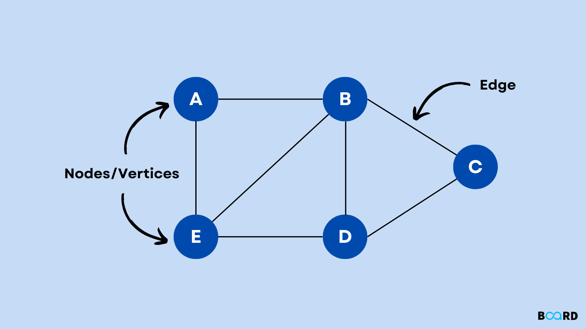
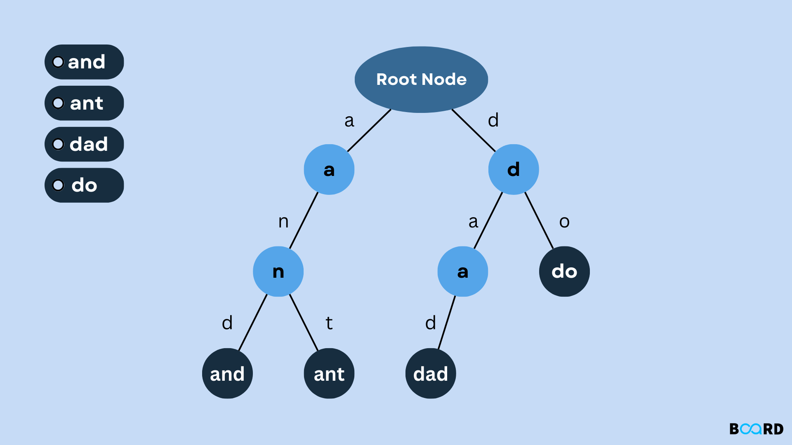

# Data Structures & Algorithms

This Repository is made for anyone who wants to learn about Big-O Notation, Data Structures, and Algorithms.

#### We Will Be Discussing Big-O Notation
---
- [What is Big-O?](#what-is-big-o)
- [Big-O Cases From Best To Worst](#big-o-cases)
- [Big-O Basic Rules](#big-o-rules)

#### We Will Be Covering The Well-Known Data Structures
---
- [Array Data Structure: (Fixed Size)](#array-structure-fixed-size)
  - [Use Cases](#array-use-cases)
- [Dynamic Array Data Structure: (Double Size)](#dynamic-array-structure-double-size)
  - [Use Cases](#dynamic-array-use-cases)
- [Linked List Data Structure](#linked-list-data-structure)
  - [Use Cases](#linked-list-use-cases)
- [Stack Data Structure](#stack-data-structure)
  - [Use Cases](#stack-use-cases)
- [Queue Data Structure](#queue-data-structure)
  - [Use Cases](#queue-use-cases)
- [Hash Table Data Structure](#hash-table-data-structure)
  - [Use Cases](#hash-table-use-cases)
- [Tree Data Structure](#tree-data-structure)
  - [Use Cases](#tree-use-cases)
- [Graph Data Structure](#graph-data-structure)
  - [Use Cases](#graph-use-cases)
- [Heap Data Structure](#heap-data-structure)
  - [Use Cases](#heap-use-cases)
- [Trie Data Structure](#trie-data-structure)
  - [Use Cases](#trie-use-cases)

#### We Will Be Discussing Some Of The Famous Algorithms Like
---
- **Sorting Algorithms:**
  - [QuickSort](#quick-sort)
  - [BubbleSort](#bubble-sort)
  - [MergeSort](#merge-sort)
- **Searching Algorithms:**
  - [Linear Search](#linear-search)
  - [Binary Search](#binary-search)
- [Breadth First Search (BFS) (coming soon)](#breadth-first-search-bfs-coming-soon)
- [Depth First Search (DFS) (coming soon)](#depth-first-search-dfs-coming-soon)

## What is Big-O?
---
Big-O is the worst-case scenario of the code, which means the high-time complexity the code gets executed in.

### Big-O Cases From Best To Worst
- O(logn) (Logarithmic)
- O(1)
- O(n) (Linear)
- O(n^2) (Quadratic)
- O(2^n) (Exponential)
- O(n!) (Worst Case)

 

### Big-O Rules
- +, -, /, x, if (1 Step) (Constant)
- Loop, SubRoutine, Function (n Steps)
- To Access Memory (2 Steps)

## Array Structure (Fixed Size)
---
An array is a collection of elements identified by their index.

### Time Complexity of An Array:
- Access = O(1)
- Search, Insert, and Delete = O(n)

### Use Cases
| Use Case                   | Description                                                                                                           |
|----------------------------|-----------------------------------------------------------------------------------------------------------------------|
| Static Data Storage        | Ideal for storing a fixed-size collection of elements where random access and constant-time retrieval are crucial.     |
| Efficient Indexing         | Provides O(1) time complexity for retrieval when accessing elements using an index.                                  |
| Simple Data Structures     | Suitable for straightforward data storage without complex relationships.                                              |
| Mathematical Operations    | Effective for mathematical operations where operations on corresponding elements are needed.                           |

 

## Dynamic Array Structure (Double Size)
---
A dynamic array doubles the size of your normal array to allow you to add new items to it.

### Use Cases
| Use Case                          | Description                                                                                                             |
|-----------------------------------|-------------------------------------------------------------------------------------------------------------------------|
| Dynamic Data Storage              | Use when a resizable collection that can efficiently grow or shrink based on the number of elements is required.        |
| Amortized Constant Time Operations | Offers amortized constant time for appending elements, making it efficient for dynamic data.                             |
| Flexible Memory Allocation         | Provides flexibility in memory allocation when the size of the data is uncertain or changes dynamically.                 |
| Balancing Space and Time           | Strikes a balance between space efficiency and time efficiency compared to fixed-size arrays.                            |

## Linked List Data Structure
---
Linked List is basically when you have a bunch of connected nodes where each node takes a value and then takes the address of the next node.

#### Double Linked List:
- Previous Address
- Value
- Next Address

### Use Cases
| Use Case                     | Description                                                                                                   |
|------------------------------|---------------------------------------------------------------------------------------------------------------|
| Dynamic Memory Allocation    | Allows dynamic memory allocation, making it suitable when the size of the data structure is unpredictable.     |
| Insertion and Deletion       | Performs better than arrays for frequent insertions and deletions due to O(1) time complexity.                   |
| No Pre-allocation of Memory  | Doesn't require pre-allocation of memory, advantageous when the size of the data varies.                          |
| Implementation of Stacks and Queues | Serves as a foundation for implementing stack and queue data structures.                                       |

 

 

## Stack Data Structure
---
Stack is a linear data structure that follows the FILO (First In Last Out) mechanism.

3 basic operations are performed in a stack:
- Push: Adds an item to the stack (top + 1)
- Pop: Removes an item from the stack (top – 1)
- Peek or Top: Returns top element stack

### Use Cases
| Use Case              | Description                                                                                               |
|-----------------------|-----------------------------------------------------------------------------------------------------------|
| Function Call History | Maintains a record of function calls, facilitating easy backtracking and debugging.                        |
| Undo Mechanism        | Used in applications where undoing the last operation is crucial, like text editors or graphic design tools. |
| Expression Evaluation | Helps in evaluating expressions and solving problems like checking balanced parentheses.                   |
| Memory Management     | Assists in managing memory by keeping track of allocated and deallocated memory blocks.                      |

 

## Queue Data Structure
---
Queue is a listing data structure that follows FIFO (First In First Out).

2 basic operations are performed in the queue:
- Rear: First Element in a Queue
- Front: Next or Last Element in a Queue

The queue starts from the Rear and ends at the Front

### Use Cases
| Use Case                  | Description                                                                                                  |
|---------------------------|--------------------------------------------------------------------------------------------------------------|
| Task Scheduling           | Facilitates task scheduling in operating systems, ensuring tasks are executed in a first-come-first-serve order. |
| Print Queue               | Manages the order in which print jobs are processed, ensuring fairness and efficient

 

## Hash Table Data Structure
---
In a hash table, data is stored in an array format, where each data value has its own unique index value.

#### Key Value Pairs
##### Hash Table Easiest Algorithm:  item % size

 

## Tree Data Structure
---
A tree data structure is a hierarchical structure composed of nodes, where each node has a value and may have links to other nodes. The topmost node in a tree is called the root, and nodes with no children are called leaves. Each node in a tree has a parent node (except for the root) and zero or more child nodes. Trees are widely used in various algorithms and applications, including hierarchical data representation.

 

## Graph Data Structure
---
A graph is a collection of nodes connected by edges. Nodes represent entities, and edges represent relationships between these entities. Graphs can be either directed (edges have a specific direction) or undirected. They are used to model a wide range of relationships, such as social networks, computer networks, and dependencies between tasks. Graphs are essential in algorithms for pathfinding, network analysis, and optimization problems.

 

## Heap Data Structure
---
A heap is a specialized tree-based data structure that satisfies the heap property. In a max heap, the value of each node is greater than or equal to the values of its children. In a min heap, the value of each node is less than or equal to the values of its children. Heaps are commonly used to implement priority queues, where elements with higher priorities are served before those with lower priorities. The heap data structure facilitates efficient insertion, deletion, and finding the minimum or maximum element.

 

## Trie Data Structure
---
A trie, also known as a prefix tree, is an ordered tree data structure that is used to store a dynamic set or associative array where the keys are usually strings. Each node in the trie represents a single character, and the path from the root to a particular node spells out a word or sequence of characters. Tries are particularly useful in applications involving autocomplete suggestions, spell checking, and efficient string-matching algorithms.

 

## Algorithms
---
### Quick Sort
---
Quicksort is a divide-and-conquer algorithm; it follows the partitioning procedure. Imagine some students standing in a line, these students should be arranged (Sorted) by their height. So what options do we have here?

 

We Got 2 Options:

1. The teacher can go and find each student's place 1 by 1.
2. Students can arrange themselves.

Now, which option is better?

Clearly, it's option 2, right? Why?

Students arranging themselves would take less time than the teacher going for their places 1 by 1. That way, students can arrange themselves by asking the left and right-hand sides if the student is taller or shorter.

Choosing The Pivot:
Pivot means the base element that you will take into consideration that will help you perform better. You might have heard about the word pivot before.

Pivot can be chosen as the first or the last element. But I wouldn't recommend it.

The reason is that you will run into the worst case if you are dealing with nearly sorted or reversed lists.

What I recommend instead is choosing the middle element as a pivot.

### Bubble Sort
---
The bubble sort algorithm uses the concept of swapping. Whenever we see elements that are out of order, we just swap them. And if we do that process multiple times, we will eventually get our array to be sorted.

 

### Merge Sort
---
With Merge Sort, what you are really doing is that you are dividing a large array into 2 halves. You sort the left half then you sort the right half, then you merge them together in a sorted way.

 

### Linear Search
---
What you are really doing here is that you are iterating through whatever you're working on (array, tree, graph) in a linear time (One by One).

 

### Binary Search
---
With binary search, you will always find yourself taking the midpoint of the array or stack that you are working with and then you compare it. For example: is 13 after or before 20? (assuming that 20 is our midpoint) It is before so what you will do is eliminate the second half of the stack (after the midpoint) and you keep repeating the process over and over till you find what you are looking for.

 

## Breadth-First Search (BFS)
---
Breadth-First Search (BFS) is an algorithm used for traversing or searching tree or graph data structures. Starting at the tree root or an arbitrary node, the algorithm explores the neighbor nodes at the present depth before moving on to nodes at the next depth level. BFS is commonly used to find the shortest path between two nodes, and it ensures that the shallowest nodes are visited first.

 

## Depth-First Search (DFS)
---
Depth-first search (DFS) is another algorithm for traversing or searching tree or graph data structures. Unlike BFS, DFS explores as far as possible along each branch before backtracking. This algorithm is often used to detect cycles in graphs, topological sorting, and solving puzzles with multiple solutions.

 
