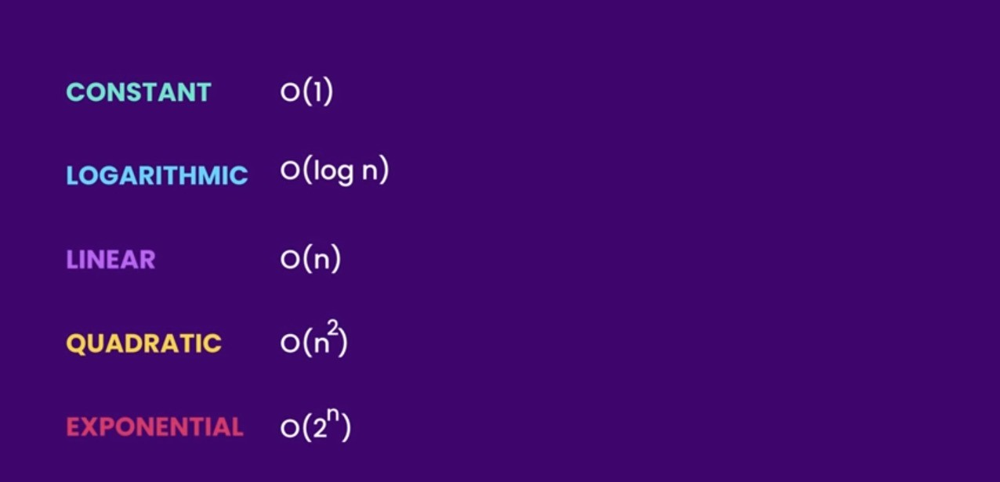

# Data Structures & Algorithms

A reference repository covering Big-O notation, data structures, and algorithms — with explanations and implementations in **Python**, **JavaScript**, and **Java**.

---

## Big-O Notation

Big-O describes the worst-case time complexity of an algorithm.

### Cases (Best to Worst)
| Notation | Name |
|---|---|
| O(1) | Constant |
| O(log n) | Logarithmic |
| O(n) | Linear |
| O(n log n) | Linearithmic |
| O(n²) | Quadratic |
| O(2ⁿ) | Exponential |
| O(n!) | Factorial |

### Basic Rules
- Arithmetic, comparisons, assignments → O(1)
- Loop over n elements → O(n)
- Memory access → O(1) amortized

---

## Data Structures

| Structure | Folder |
|---|---|
| Array | [data-structures/array](data-structures/array/) |
| Dynamic Array | [data-structures/dynamic-array](data-structures/dynamic-array/) |
| Linked List | [data-structures/linked-list](data-structures/linked-list/) |
| Stack | [data-structures/stack](data-structures/stack/) |
| Queue | [data-structures/queue](data-structures/queue/) |
| Deque | [data-structures/deque](data-structures/deque/) |
| Hash Table | [data-structures/hash-table](data-structures/hash-table/) |
| Binary Search Tree | [data-structures/binary-search-tree](data-structures/binary-search-tree/) |
| AVL Tree | [data-structures/avl-tree](data-structures/avl-tree/) |
| Graph | [data-structures/graph](data-structures/graph/) |
| Heap | [data-structures/heap](data-structures/heap/) |
| Trie | [data-structures/trie](data-structures/trie/) |
| Union-Find | [data-structures/union-find](data-structures/union-find/) |
| Segment Tree | [data-structures/segment-tree](data-structures/segment-tree/) |

---

## Algorithms

### Sorting
| Algorithm | Folder |
|---|---|
| Bubble Sort | [algorithms/sorting/bubble-sort](algorithms/sorting/bubble-sort/) |
| Merge Sort | [algorithms/sorting/merge-sort](algorithms/sorting/merge-sort/) |
| Quick Sort | [algorithms/sorting/quick-sort](algorithms/sorting/quick-sort/) |
| Insertion Sort | [algorithms/sorting/insertion-sort](algorithms/sorting/insertion-sort/) |
| Selection Sort | [algorithms/sorting/selection-sort](algorithms/sorting/selection-sort/) |
| Heap Sort | [algorithms/sorting/heap-sort](algorithms/sorting/heap-sort/) |
| Radix Sort | [algorithms/sorting/radix-sort](algorithms/sorting/radix-sort/) |

### Searching
| Algorithm | Folder |
|---|---|
| Linear Search | [algorithms/searching/linear-search](algorithms/searching/linear-search/) |
| Binary Search | [algorithms/searching/binary-search](algorithms/searching/binary-search/) |

### Graph
| Algorithm | Folder |
|---|---|
| Breadth-First Search | [algorithms/graph/bfs](algorithms/graph/bfs/) |
| Depth-First Search | [algorithms/graph/dfs](algorithms/graph/dfs/) |
| Dijkstra's Shortest Path | [algorithms/graph/dijkstra](algorithms/graph/dijkstra/) |
| Bellman-Ford | [algorithms/graph/bellman-ford](algorithms/graph/bellman-ford/) |
| Floyd-Warshall | [algorithms/graph/floyd-warshall](algorithms/graph/floyd-warshall/) |
| Prim's MST | [algorithms/graph/prims-mst](algorithms/graph/prims-mst/) |
| Kruskal's MST | [algorithms/graph/kruskals-mst](algorithms/graph/kruskals-mst/) |

### Dynamic Programming
| Algorithm | Folder |
|---|---|
| Fibonacci | [algorithms/dynamic-programming/fibonacci](algorithms/dynamic-programming/fibonacci/) |
| 0/1 Knapsack | [algorithms/dynamic-programming/knapsack](algorithms/dynamic-programming/knapsack/) |
| Longest Common Subsequence | [algorithms/dynamic-programming/longest-common-subsequence](algorithms/dynamic-programming/longest-common-subsequence/) |
| Longest Increasing Subsequence | [algorithms/dynamic-programming/longest-increasing-subsequence](algorithms/dynamic-programming/longest-increasing-subsequence/) |
| Coin Change | [algorithms/dynamic-programming/coin-change](algorithms/dynamic-programming/coin-change/) |

### String
| Algorithm | Folder |
|---|---|
| KMP Pattern Matching | [algorithms/string/kmp](algorithms/string/kmp/) |
| Rabin-Karp | [algorithms/string/rabin-karp](algorithms/string/rabin-karp/) |
