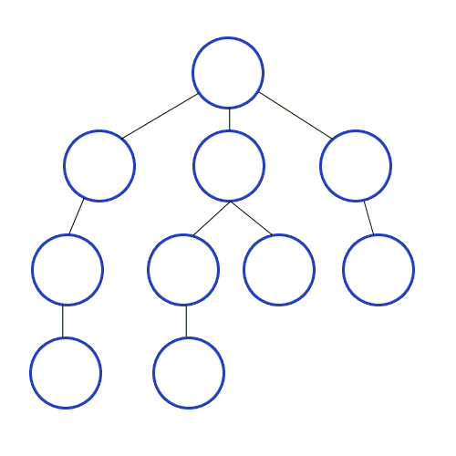

# Depth-First Search (DFS)

DFS explores a graph by going as deep as possible along each branch before backtracking. It uses a **stack** (or recursion) to track the current path.

## How It Works

1. Push/visit the start node and mark it visited
2. Recursively (or iteratively) visit each unvisited neighbour
3. Backtrack when all neighbours of the current node are visited
4. Continue until all reachable nodes are visited

## Time Complexity

| Complexity | Value |
|---|---|
| Time | O(V + E) — V vertices, E edges |
| Space | O(V) — call stack / explicit stack + visited set |

## Use Cases

| Use Case | Description |
|---|---|
| Cycle Detection | DFS can detect back edges that indicate cycles |
| Topological Sort | DFS on a DAG produces a valid topological ordering |
| Maze / Puzzle Solving | DFS explores all paths to find a solution |
| Connected Components | Identify all nodes in each component |

## Implementations

- [Python](implementation.py)
- [JavaScript](implementation.js)
- [Java](implementation.java)
