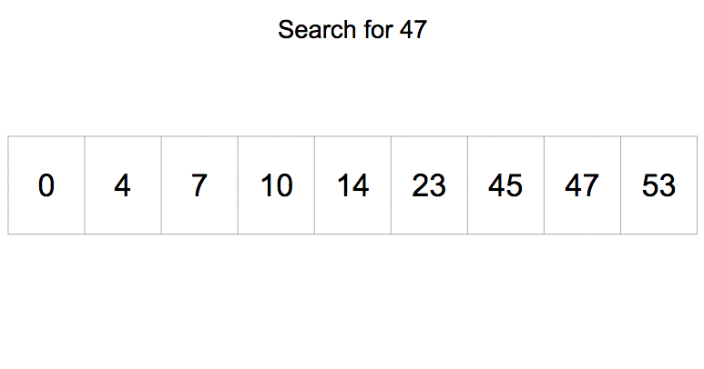

# Binary Search

Binary search finds a target in a **sorted** array by repeatedly halving the search space. It compares the target to the midpoint and eliminates the half where the target cannot be.

## How It Works

1. Set `low = 0`, `high = n - 1`
2. Compute `mid = (low + high) // 2`
3. If `arr[mid] == target` → found, return `mid`
4. If `target < arr[mid]` → search left half: `high = mid - 1`
5. If `target > arr[mid]` → search right half: `low = mid + 1`
6. If `low > high` → not found, return -1

## Time Complexity

| Case | Complexity |
|---|---|
| Best (midpoint is target) | O(1) |
| Average | O(log n) |
| Worst | O(log n) |

**Space:** O(1) iterative / O(log n) recursive stack

## Use Cases

| Use Case | Description |
|---|---|
| Sorted Arrays | The go-to search for any sorted collection |
| Dictionary Lookups | Fast word lookup in sorted word lists |
| Finding Boundaries | Find first/last occurrence or insertion point |
| Answer-Space Search | Binary search on monotonic functions (e.g. square root) |

## Implementations

- [Python](implementation.py)
- [JavaScript](implementation.js)
- [Java](implementation.java)
