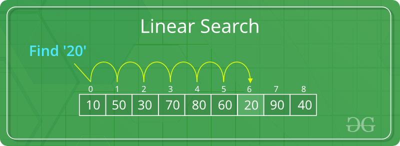

# Linear Search

Linear search iterates through every element one by one until it finds the target or exhausts the collection. It works on any sequence — sorted or unsorted.

## How It Works

1. Start at index 0
2. Compare the current element to the target
3. If equal, return the index
4. Move to the next element
5. If the end is reached without a match, return -1

## Time Complexity

| Case | Complexity |
|---|---|
| Best (first element) | O(1) |
| Average | O(n) |
| Worst (last or not found) | O(n) |

**Space:** O(1)

## Use Cases

| Use Case | Description |
|---|---|
| Unsorted Data | Only option when data has no ordering |
| Small Collections | Simple and fast enough for tiny arrays |
| Linked Lists | No random access — must traverse sequentially |
| One-Off Searches | No need to pre-sort data for a single lookup |

## Implementations

- [Python](implementation.py)
- [JavaScript](implementation.js)
- [Java](implementation.java)
