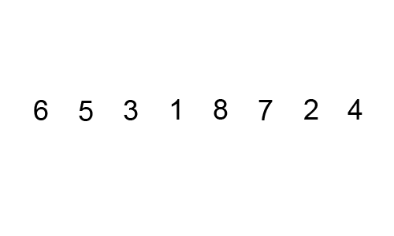

# Bubble Sort

Bubble sort repeatedly steps through the array, compares adjacent elements, and swaps them if they are in the wrong order. After each full pass, the largest unsorted element "bubbles up" to its correct position at the end.

## How It Works

1. Compare `arr[0]` and `arr[1]` — swap if `arr[0] > arr[1]`
2. Move to `arr[1]` and `arr[2]`, repeat
3. After the first pass, the largest element is at the end
4. Repeat for the remaining unsorted portion
5. Early-exit optimisation: if no swaps occur in a full pass, the array is already sorted

## Time Complexity

| Case | Complexity |
|---|---|
| Best (already sorted) | O(n) |
| Average | O(n²) |
| Worst (reverse sorted) | O(n²) |

**Space:** O(1) — in-place

## Use Cases

| Use Case | Description |
|---|---|
| Education | Simplest sorting algorithm to understand and implement |
| Nearly Sorted Data | With early exit, degrades gracefully on almost-sorted input |
| Tiny Arrays | Overhead-free for very small n where simplicity beats performance |

## Implementations

- [Python](implementation.py)
- [JavaScript](implementation.js)
- [Java](implementation.java)
