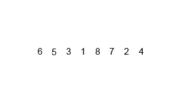

# Merge Sort

Merge sort is a divide-and-conquer algorithm. It recursively splits the array in half, sorts each half, then merges the two sorted halves back together.

## How It Works

1. **Divide** — split the array at the midpoint into left and right halves
2. **Conquer** — recursively sort each half
3. **Merge** — combine the two sorted halves by comparing front elements and appending the smaller one

Base case: an array of 0 or 1 elements is already sorted.

## Time Complexity

| Case | Complexity |
|---|---|
| Best | O(n log n) |
| Average | O(n log n) |
| Worst | O(n log n) |

**Space:** O(n) — requires auxiliary arrays during merge

## Use Cases

| Use Case | Description |
|---|---|
| Stable Sorting | Preserves relative order of equal elements — important for multi-key sorts |
| Linked List Sorting | Performs well on linked lists where random access is expensive |
| External Sorting | Used to sort data larger than memory by merging sorted chunks |
| Counting Inversions | Modified merge sort counts inversions in O(n log n) |

## Implementations

- [Python](implementation.py)
- [JavaScript](implementation.js)
- [Java](implementation.java)
