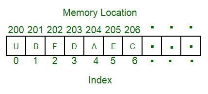

# Array

An array is a collection of elements stored at contiguous memory locations, each identified by an index. The size is fixed at creation time.

## How It Works

- Elements are stored sequentially in memory
- Access any element instantly using its index: `arr[i]`
- Inserting or deleting in the middle requires shifting elements

## Time Complexity

| Operation | Complexity |
|---|---|
| Access | O(1) |
| Search | O(n) |
| Insert (end) | O(1) |
| Insert (middle) | O(n) |
| Delete (end) | O(1) |
| Delete (middle) | O(n) |

**Space:** O(n)

## Use Cases

| Use Case | Description |
|---|---|
| Static Data Storage | Fixed-size collections where random access matters |
| Efficient Indexing | O(1) retrieval by index |
| Mathematical Operations | Element-wise operations on sequences |
| Buffer / Cache | Backing store for circular buffers and caches |

## Implementations

- [Python](implementation.py)
- [JavaScript](implementation.js)
- [Java](implementation.java)
