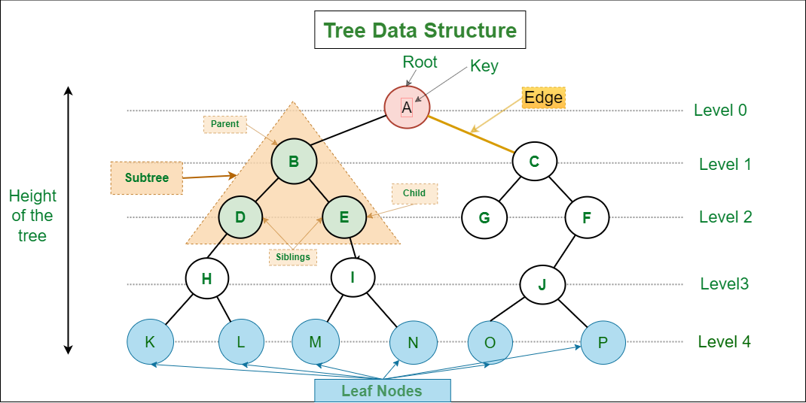

# Binary Search Tree (BST)

A binary search tree is a node-based data structure where each node has at most two children. For every node N:
- All values in the **left** subtree are **less than** N
- All values in the **right** subtree are **greater than** N

This ordering property makes search, insert, and delete efficient on average.

## How It Works

- **Search** — compare target with current node; go left if smaller, right if larger
- **Insert** — follow the same path as search until you find an empty spot
- **Delete** — three cases: leaf (remove directly), one child (replace with child), two children (replace with in-order successor)
- **In-order traversal** — left → root → right yields elements in sorted order

## Time Complexity

| Operation | Average | Worst Case (unbalanced) |
|---|---|---|
| Search | O(log n) | O(n) |
| Insert | O(log n) | O(n) |
| Delete | O(log n) | O(n) |
| In-order traversal | O(n) | O(n) |

Worst case occurs when the tree degenerates into a linked list (sorted insertions). See [AVL Tree](../avl-tree/) for a self-balancing alternative.

**Space:** O(n)

## Use Cases

| Use Case | Description |
|---|---|
| Sorted Data Storage | In-order traversal always produces a sorted sequence |
| Range Queries | Efficiently find all values within a range [lo, hi] |
| Auto-complete / Prefix Search | BST variants power sorted dictionary lookups |
| Database Indexing | B-Trees (generalised BSTs) back most database indexes |

## Implementations

- [Python](implementation.py)
- [JavaScript](implementation.js)
- [Java](implementation.java)
