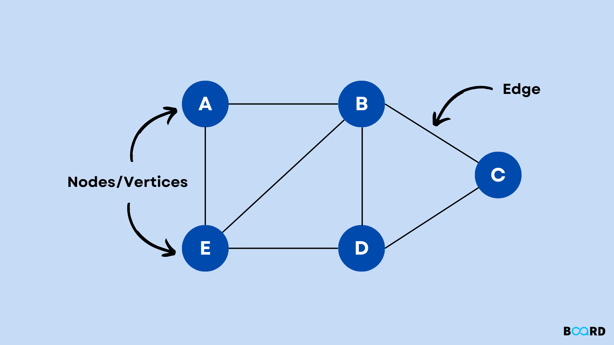

# Graph

A graph is a collection of **nodes** (vertices) connected by **edges**. It models relationships between entities — social networks, road maps, dependency trees, and more.

## Types

- **Directed** — edges have a direction (A → B does not imply B → A)
- **Undirected** — edges are bidirectional
- **Weighted** — edges carry a numeric cost (distance, time, capacity)
- **Unweighted** — all edges are equal

## Representations

**Adjacency List** (most common) — each node maps to a list of its neighbours. Space-efficient for sparse graphs.

**Adjacency Matrix** — 2D array where `matrix[i][j] = 1` means an edge exists. O(1) edge lookup but O(V²) space.

## Time Complexity (Adjacency List)

| Operation | Complexity |
|---|---|
| Add vertex | O(1) |
| Add edge | O(1) |
| Remove edge | O(E) |
| Check edge | O(degree) |
| BFS / DFS | O(V + E) |

**Space:** O(V + E)

## Use Cases

| Use Case | Description |
|---|---|
| Social Networks | Users are nodes; friendships are edges |
| Shortest Path | GPS navigation uses weighted directed graphs |
| Dependency Resolution | Package managers model install order as a DAG |
| Recommendation Systems | User-item graphs power collaborative filtering |

## Implementations

- [Python](implementation.py)
- [JavaScript](implementation.js)
- [Java](implementation.java)
