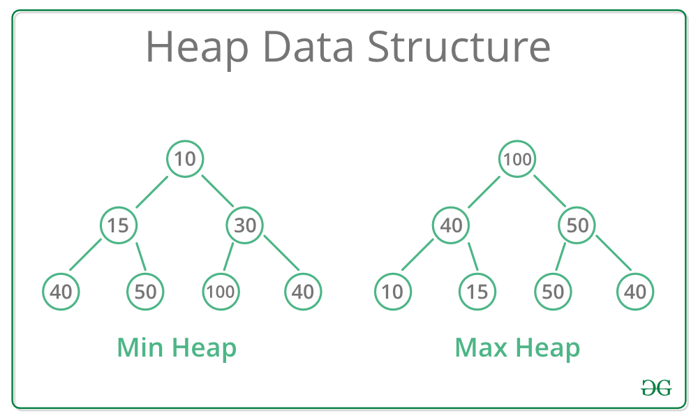

# Heap

A heap is a complete binary tree stored as an array that satisfies the **heap property**:

- **Min-Heap** — every parent is ≤ its children. The minimum is always at the root.
- **Max-Heap** — every parent is ≥ its children. The maximum is always at the root.

## Array Representation

For a node at index `i`:
- Left child → `2i + 1`
- Right child → `2i + 2`
- Parent → `(i - 1) // 2`

No pointers needed — the structure is implicit in the array indices.

## How It Works

- **Push** — append to the end, then **bubble up** (swap with parent while heap property is violated)
- **Pop** — swap root with last element, remove last, then **bubble down** (swap with smaller/larger child)
- **Peek** — return `arr[0]` in O(1)

## Time Complexity

| Operation | Complexity |
|---|---|
| Push | O(log n) |
| Pop | O(log n) |
| Peek (min/max) | O(1) |
| Build heap from array | O(n) |

**Space:** O(n)

## Use Cases

| Use Case | Description |
|---|---|
| Priority Queue | Serve the highest-priority task in O(log n) |
| Dijkstra's Algorithm | Extract the nearest unvisited node efficiently |
| Heap Sort | In-place O(n log n) sorting using a max-heap |
| Median Maintenance | Two heaps (min + max) track the running median |

## Implementations

- [Python](implementation.py)
- [JavaScript](implementation.js)
- [Java](implementation.java)
