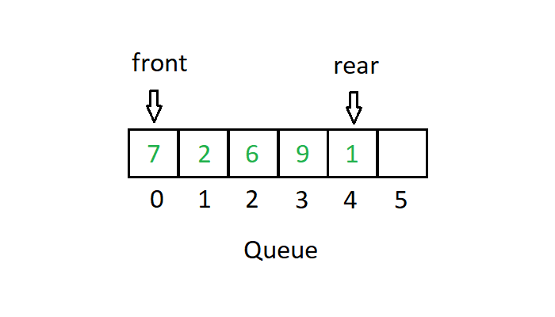

# Queue

A queue is a linear data structure that follows **FIFO** (First In, First Out). The first element enqueued is the first one dequeued — like a line of customers.

## How It Works

Two core operations:
- **Enqueue** — add an element to the rear
- **Dequeue** — remove and return the element at the front

The queue maintains a **front** pointer and a **rear** pointer. Enqueue advances rear; dequeue advances front.

## Time Complexity

| Operation | Complexity |
|---|---|
| Enqueue | O(1) |
| Dequeue | O(1) |
| Peek (front) | O(1) |
| Search | O(n) |

**Space:** O(n)

## Use Cases

| Use Case | Description |
|---|---|
| Task Scheduling | OS process schedulers process tasks in arrival order |
| Print Queue | Print jobs are processed in the order they are submitted |
| BFS Graph Traversal | BFS uses a queue to explore nodes level by level |
| Rate Limiting | Request queues control throughput in APIs and servers |

## Implementations

- [Python](implementation.py)
- [JavaScript](implementation.js)
- [Java](implementation.java)
