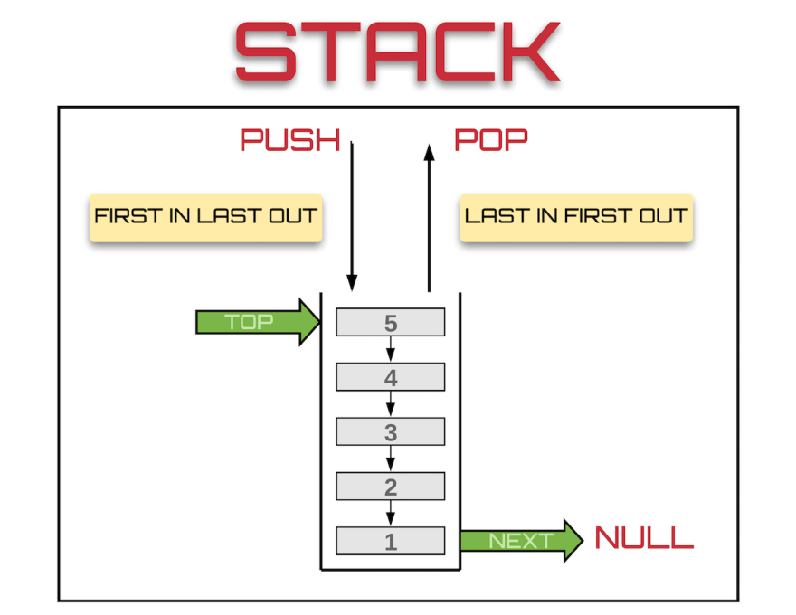

# Stack

A stack is a linear data structure that follows **LIFO** (Last In, First Out). The last element pushed onto the stack is the first one popped off — like a stack of plates.

## How It Works

Three core operations:
- **Push** — add an element to the top
- **Pop** — remove and return the top element
- **Peek** — return the top element without removing it

## Time Complexity

| Operation | Complexity |
|---|---|
| Push | O(1) |
| Pop | O(1) |
| Peek | O(1) |
| Search | O(n) |

**Space:** O(n)

## Use Cases

| Use Case | Description |
|---|---|
| Function Call Stack | The runtime uses a stack to track active function calls and return addresses |
| Undo / Redo | Text editors push actions onto a stack; undo pops them |
| Expression Evaluation | Used to evaluate postfix expressions and check balanced parentheses |
| DFS Traversal | Iterative depth-first search uses an explicit stack instead of recursion |

## Implementations

- [Python](implementation.py)
- [JavaScript](implementation.js)
- [Java](implementation.java)
