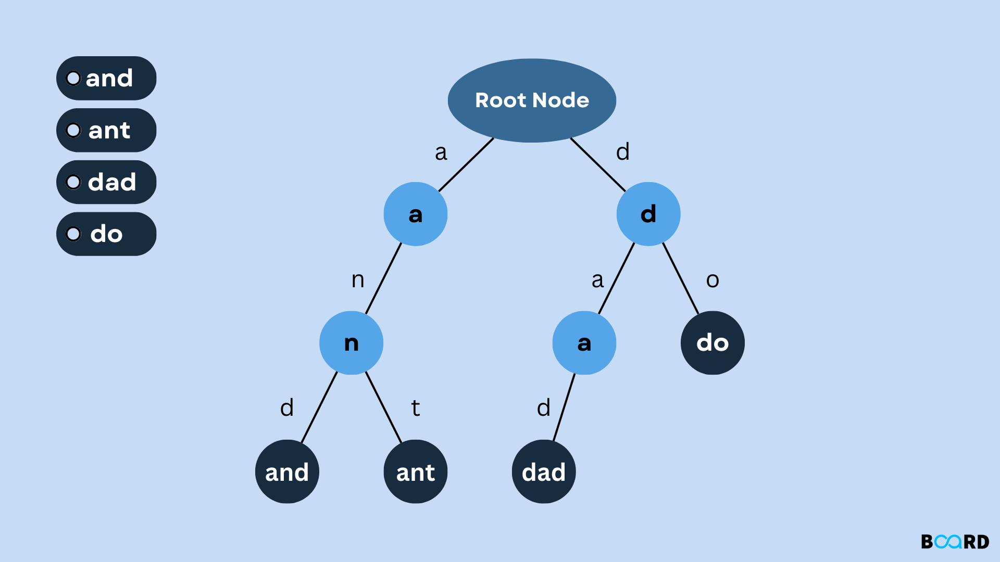

# Trie (Prefix Tree)

A trie is a tree where each node represents a single character. Paths from root to a node spell out a prefix; paths to marked nodes spell out complete words. It trades memory for extremely fast prefix-based lookups.

## How It Works

- Each node has up to 26 children (one per letter for lowercase English)
- **Insert** — walk the path character by character, creating nodes as needed, mark last node as end-of-word
- **Search** — walk the path; return true only if you reach the end and the node is marked
- **StartsWith** — walk the path; return true if all characters exist (no end-of-word check)

## Time Complexity

| Operation | Complexity |
|---|---|
| Insert | O(m) — m = word length |
| Search | O(m) |
| StartsWith | O(m) |
| Delete | O(m) |

**Space:** O(n × m) — n words of average length m

## Use Cases

| Use Case | Description |
|---|---|
| Autocomplete | Instantly suggest all words sharing a prefix |
| Spell Checking | Validate words and suggest corrections |
| IP Routing | Longest-prefix match in routing tables |
| Word Games | Scrabble / Boggle solvers enumerate valid words |

## Implementations

- [Python](implementation.py)
- [JavaScript](implementation.js)
- [Java](implementation.java)
